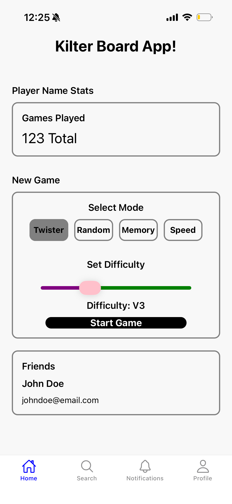
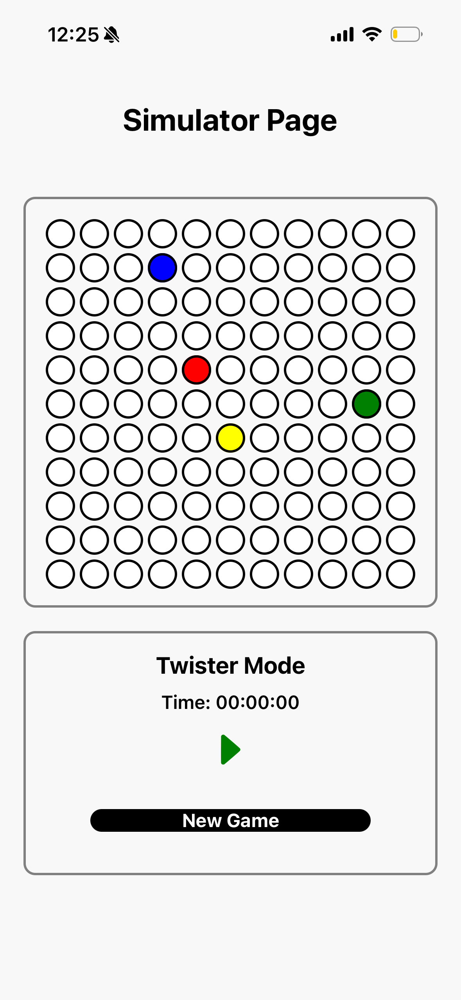

# Route Roulette - Kilter Board Simulator

A mobile application inspired by the Kilter Board training system. This capstone project recreates some of the interactive features of a Kilter Board through a simulated climbing board and several game modes designed to test memory, speed, and reaction.

## Overview

The Kilter Board Simulator is a React Native mobile application developed as a capstone project. The application allows users to select a game mode and difficulty before interacting with an animated Kilter Board simulator.

The project focuses on recreating the interactive experience of a climbing training board without requiring physical Kilter Board hardware.

### Features

- Kilter Board-style 11×11 grid
- Animated climbing holds
- Multiple game modes
- Adjustable difficulty
- Game start and stop controls
- New game/reset functionality
- Timer-based gameplay
- Dynamic hold sequences
- Home screen with game statistics preview
- Stack-based navigation between screens

## Game Modes

The application includes several game modes designed around different types of climbing and memory challenges:

- **Twister** — challenges the user to follow randomized hold sequences with color to limb correspondence.
- **Speed** — challenges the user to complete a sequence that increases in speed over time.
- **Memory Sequence** — displays a sequence that the user must remember and reproduce.
- **Randomized Holds** — generates randomized holds for the user to interact with for an unlimited amount of time to improve endurance.

## Technologies Used

- **React Native** — Used to develop the mobile application.
- **Expo Go** — Used to load and test the application on a mobile device.
- **JavaScript** — Used for application and game logic.
- **Git/GitHub** — Used for version control and project management.

## Application Structure

The application is organized around multiple screens and components.

### 1. Home/Landing Page

- Displays a preview of user statistics.
- Allows the user to select a game mode.
- Allows the user to select a difficulty level.
- Passes the selected options to the simulator.

### 2. Simulator Page

- Displays the Kilter Board animation.
- Controls the current game.
- Uses timers and state variables to control gameplay.
- Allows the user to start and stop a game.
- Allows the user to begin a new game.

### 3. Navigation

- Uses stack-based navigation to move between the home page and simulator.
- Resets the simulator screen when a new game is selected.

## Getting Started

### Prerequisites

Before running the project, make sure you have:

- Node.js installed
- npm installed
- Expo Go installed on a mobile device
- A computer and mobile device connected to the same network

### Installation

Clone the repository:
```bash
git clone <repository-url>
```

Navigate into the project directory:
```bash
cd <project-folder>
```

Install the required dependencies:
```bash
npm install
```

### Running the Application

Start the Expo development server:
```bash
npx expo start
```

After the Expo server starts:
1. Open **Expo Go** on your mobile device.
2. Scan the QR code displayed in the terminal or Expo development interface.
3. The application will load on your device.
4. Select a game mode and difficulty from the home screen.
5. Launch the game to access the Kilter Board simulator.


<p align="center">
  
  
</p>

<p align="center">
  <em>Home screen (left) and Kilter Board simulator (right)</em>
</p>

### Project Purpose

The purpose of this project is to leverage the Kilter Board to gamify indoor rock-climbing training. The project combines mobile application development, state management, timers, animations, and game logic to create an interactive training experience.

### Future Improvements

Potential future improvements include:

- Additional game modes
- Difficulty setting implementation in line with rock climbing "v grade scale"
- User accounts and saved statistics
- Persistent game history
- Profile customization (use user height and wingspan to adjust randomization parameters)
- Expand simulation grid to replicate a full-sized Kilter Board


